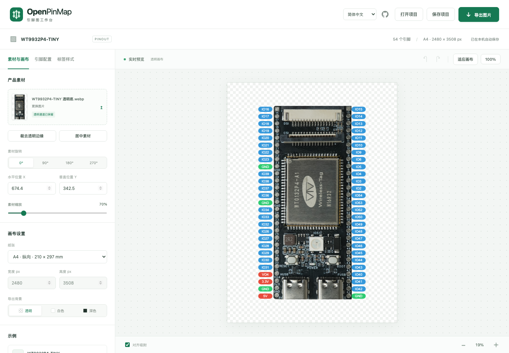
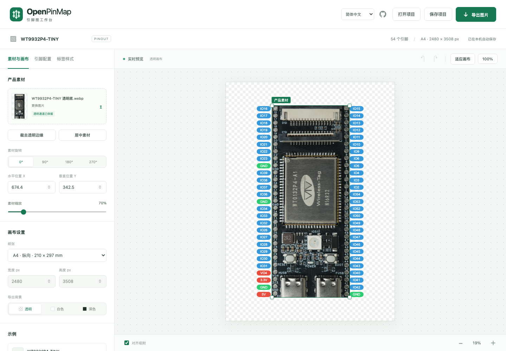
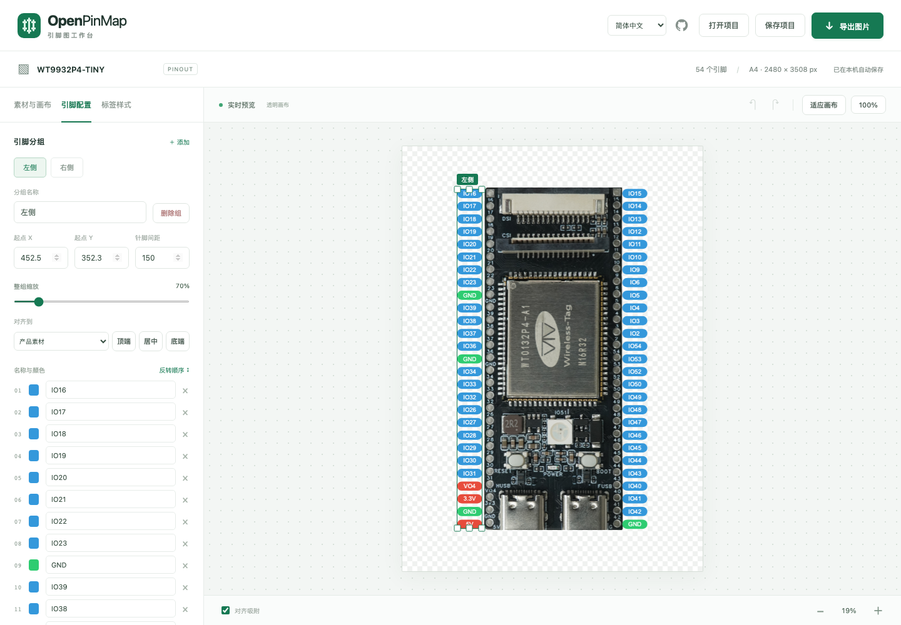
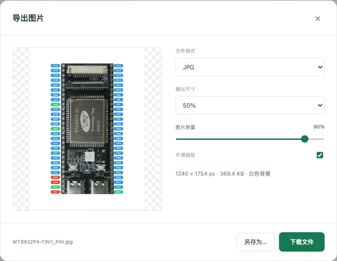

简体中文 | [English](README.en.md)

<div align="center">
  
  <h1>OpenPinMap</h1>
  <p><strong>浏览器里的开发板引脚图编辑器</strong></p>
  <p>A4 排版 · 拖拽标注 · 导出 PNG / SVG / JPG</p>
  <p>
    <a href="https://geekheart.github.io/OpenPinMap/"><strong>打开在线工作台 →</strong></a>
    &nbsp; · &nbsp;
    <a href="#快速开始">本地运行</a>
    &nbsp; · &nbsp;
    <a href="docs/deployment.md">部署指南</a>
    &nbsp; · &nbsp;
    <a href="https://github.com/geekheart/OpenPinMap/releases/latest/download/OpenPinMap.html" download>离线单文件</a>
  </p>
  <p><code>实时预览</code> &nbsp; <code>透明 PNG</code> &nbsp; <code>JSON 配置</code> &nbsp; <code>纯前端</code></p>
</div>



上传开发板的正面产品图，设置两侧引脚名称、颜色与间距，拖动标签对齐焊孔，再导出可用于手册或产品页的引脚图。

默认使用 **WT9932P4-TINY** 透明底产品图与 54 个引脚，按用户提供的 P4 参考配置排版。S31 HDK 示例仍保存在 `examples/s31.json`。图片与引脚来源见[素材说明](docs/assets.md)。

页面默认使用简体中文。右上角可切换 **简体中文 / English**，也可通过 [?lang=en](https://geekheart.github.io/OpenPinMap/?lang=en) 直接打开英文界面。切换只影响操作界面，保留当前项目、未应用的批量文本、引脚名称与分组名称。旁边的 GitHub 图标可打开项目源码。离线单文件同样包含两种语言，无需联网加载语言包。

## 可以做什么

| 功能 | 操作 |
| --- | --- |
| 图片处理 | 上传或拖入 PNG / JPEG / WebP；裁去透明边缘，调整位置与缩放，0° / 90° / 180° / 270° 旋转 |
| 多组引脚 | 新增分组和引脚，编辑名称、单针颜色、起点与间距，批量录入或反转顺序 |
| 拖拽排版 | 点击图片或 PIN 组选中；四角等比缩放，上下中点调整整组间距；拖动移动，吸附对齐 |
| 标签样式 | 字号、字体、圆角、引线和 GPIO / 电源 / GND 配色 |
| A4 画布 | 纵向 210 × 297 mm / 横向 297 × 210 mm，300 DPI；也可自定义像素尺寸 |
| 画布缩放 | 鼠标滚轮、触控板捏合、双指缩放；空白处或空格加拖动平移 |
| 图片导出 | PNG 无损透明、SVG 矢量标签、JPG 质量调节；实时预览尺寸及文件大小 |
| 项目保存 | 下载包含图片和全部排版设置的 JSON；支持旧 Pins Studio 项目 |
| 草稿与历史 | IndexedDB 本机自动保存，最多 30 个历史状态，撤销 / 重做 |
| 生成器兼容 | 导入 pins_pic_gen 配置，导出可供原 generate.py 使用的 JSON 和底图 |

编辑和导出在浏览器中完成，不上传用户图片或配置。网站自身的静态文件由托管服务器提供。清理浏览器数据会删除本机草稿，需要长期保留时使用“保存项目”。

## 从图片到引脚图

### 1. 放入素材，调整画布



点击开发板图片，绿色外框表示素材已选中。拖动图片移动位置，拖动四角等比缩放；左侧可输入 X/Y、选择 **0° / 90° / 180° / 270°** 旋转。旋转时保留素材中心位置。

画布默认 A4 纵向，可切换横向或自定义尺寸。鼠标滚轮和触控板捏合缩放画布，空白处拖动或空格加拖动平移。透明底 PNG / WebP 更适合排版；选择透明画布不会自动去掉照片自身的白底。

### 2. 编辑与对齐整组 PIN



点击任意标签选中整组 PIN，拖动移动整组；四角手柄同时缩放文字、标签和间距，上下中点手柄只调整针脚间距。左侧可以修改名称、颜色、起点和缩放比例，支持批量编辑与反转顺序。

“对齐到”选择产品素材、画布或另一组 PIN，再点击顶端、居中或底端。开启画布下方的“对齐吸附”后，拖动接近边缘或中心时会吸附，并显示参考线。

显示名称、连接器针号与 GPIO 编号是不同字段。P4 示例按正面观察、USB 朝下排版，保留配置中的 IO9、IO6、VO4 等原始名称。请对照实际工程核验顺序，通用编辑器不会验证新开发板的电气连接。

### 3. 选择格式并导出



点击右上角“导出图片”打开设置窗口。示例选择 **JPG、50% 输出尺寸、90% 图片质量**；左侧预览导出外观，下方显示实际像素尺寸和文件大小。调整设置后等待预览完成，再点击“下载文件”或“另存为…”。

需要继续编辑时，用“保存项目”下载 JSON；素材、旋转角度、PIN 分组变换和导出设置都会保留。

## 导出质量与压缩

- **PNG**：无损编码，保留透明通道；选择 25%、50%、75% 等输出尺寸可以减小文件。PNG 不使用有损质量滑块。
- **JPG**：质量范围 10%–100%，透明区域会合成白色背景。质量百分比不是固定的文件体积压缩比例。
- **SVG**：标签和引线保留矢量，照片内嵌；可关闭素材压缩保留原图，或按输出尺寸及质量重新编码内嵌 WebP。产品照片不会自动变为矢量。

导出窗口显示实际文件大小，预览不含选择框或吸附线。A4 的 PNG/JPG 写入对应 DPI，50% 输出为 150 DPI；SVG 使用毫米纸张尺寸和原始坐标 viewBox。超出纸张的内容按画布边界裁切。

“另存为…”在支持 File System Access 的浏览器中打开系统保存窗口；“下载文件”使用浏览器常规下载。是否每次询问保存位置由浏览器设置决定。[浏览器保存 API](https://developer.mozilla.org/en-US/docs/Web/API/Window/showSaveFilePicker)、[Canvas 导出质量](https://developer.mozilla.org/en-US/docs/Web/API/HTMLCanvasElement/toBlob)。

## 保存与恢复

- **保存项目 / 打开项目**：完整图片与参数，跨浏览器、跨设备恢复。
- **导入 pins_pic_gen JSON**：只导入标签配置，当前图片保留为底图；配置本身不含产品图片。
- **生成器文件 → 导出配置 / 导出底图**：将两份文件放在同一目录，使用原 Python 生成器重新绘制。

格式、坐标约定、限制和 Python 兼容细节见[文件格式](docs/project-format.md)。

快捷键：`Ctrl/⌘ Z` 撤销，`Ctrl/⌘ Shift Z` 重做，`Ctrl/⌘ S` 保存项目；输入框内保留浏览器原生编辑快捷键。

## 快速开始

使用 Node.js 24 或更高版本：

```sh
git clone https://github.com/geekheart/OpenPinMap.git
cd OpenPinMap
npm ci
npm run dev
```

打开终端中的地址，默认 <http://127.0.0.1:8766/OpenPinMap/>。修改代码后运行 `npm run build` 并刷新页面。

仅构建静态页面不需要安装测试依赖：

```sh
node scripts/build.mjs
```

构建得到 `dist/` 网站和 `dist/OpenPinMap.html` 离线单文件。独立 HTML 可直接双击打开；源目录 `index.html` 需要生成 `defaults.js` 后才能使用，请通过构建后的目录访问。

## 部署

本仓库使用 [GitHub Actions](.github/workflows/pages.yml) 自动测试与发布：main 提交和标签推送触发 Pages 更新，PR 只执行检查。发布时采用相对资源路径，支持仓库子路径。完整步骤与 `gh` 检查命令见[部署指南](docs/deployment.md)。

也可以将 `dist/` 上传到任意静态托管服务，无需服务端运行环境。

## 开发与验证

```sh
npm test
npm run build
npx playwright install chromium
npm run test:e2e
```

单元测试覆盖 P4/S31 引脚顺序、v1/v2 项目兼容、变换参数、PNG/JPG DPI 元数据、SVG 转义、语言目录完整性、语言切换的数据隔离和静态构建路径。浏览器测试覆盖画布缩放、拖拽手柄、项目保存恢复、导入导出、JPG 质量、SVG 标签及移动端布局。Actions 中保留截图和失败诊断；测试通过后才发布。

```text
app.js                  编辑交互、Canvas 渲染与文件操作
src/i18n.js             中文与英文界面文案、显式翻译绑定
src/model.js            项目及引脚配置校验
src/export.js           DPI 元数据与 SVG 转义
style.css               桌面与移动端布局
examples/p4.json        默认 P4 A4 示例
examples/s31.json       保留的 S31 HDK 示例
assets/                 透明产品素材与图标
scripts/                静态构建、本地服务器
tests/                  数据、构建及浏览器回归测试
docs/                   素材、格式与部署说明
.github/workflows/      自动检查与 Pages 发布
```

页面不使用运行时第三方库。Playwright 是开发测试依赖；Node.js 仅用于构建与开发。README 组织和自动发布方式参考 [OpenBoxHub](https://github.com/geekheart/OpenBoxHub)。开发约定见 [AGENTS.md](AGENTS.md)，参与方式见 [CONTRIBUTING.md](CONTRIBUTING.md)。产品图片及商标归属见[素材说明](docs/assets.md)。

## 许可证

项目代码与原创文档使用 [MIT License](LICENSE)，Copyright (c) 2026 geekheart。第三方依赖保留各自许可证；产品图片、器件标识和商标仍归各自权利人，MIT 不另行授予这些素材的图片或商标权利。来源与素材范围见[素材说明](docs/assets.md)。
